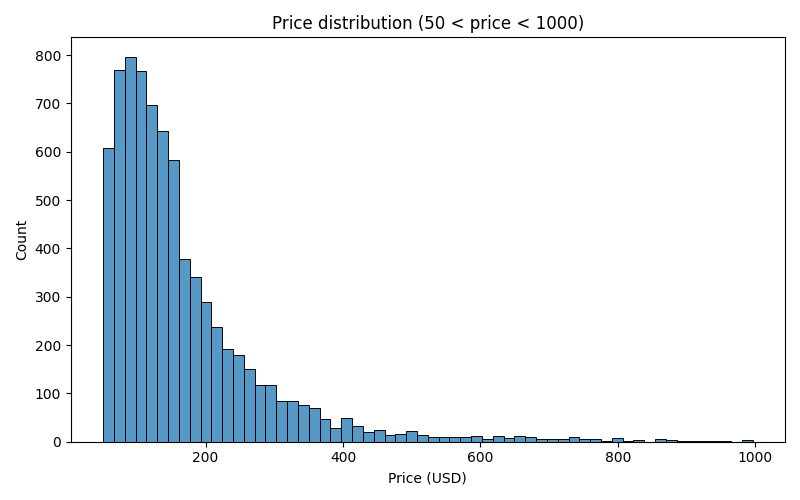
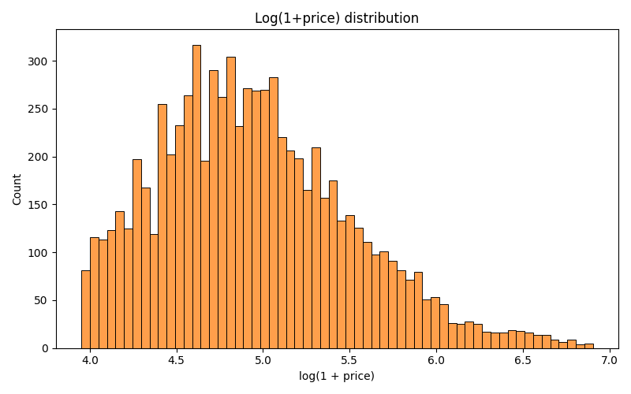
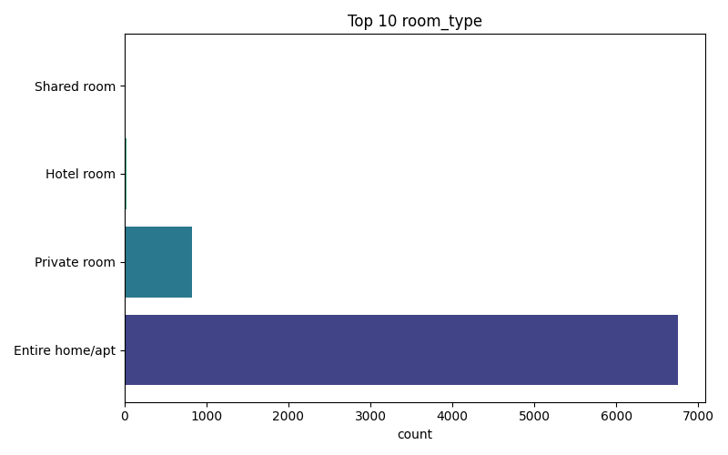
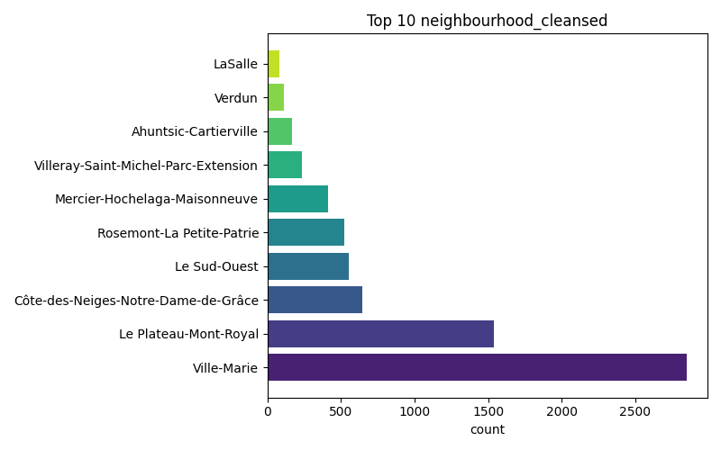

# EDA — Multi‑Modal Airbnb Price Predictor (Montreal)

**Generated:** outputs/report.txt → converted to Markdown for GitHub viewing

---

## Executive summary

- Dataset reduced from **9550 → 7612** rows after filtering price to (50, 1000). Final N = **7612**.  
- Central tendency: **mean = $167.12**, **median = $133.00** (distribution skewed).  

---

## Data quality & image availability

- Sampled image URL reachability (HEAD requests): **100 / 100 OK**.  
- Examples of reachable images (sample):
  - `outputs/figures/price_hist.png` (see figures section)  

---

## Feature notes & preprocessing decisions

- **Price:** cleaned from string to float; entries outside (50, 1000) were removed.  
- **Text:** `description` + `amenities` concatenated for vision+language backbone input.  
- **Tabular:** only `room_type`, `neighbourhood_cleansed`, `accommodates`, `bathrooms`, `bedrooms` kept; numeric columns min–max normalized.  

---

## Initial modeling recommendations

1. Use a frozen CLIP/ViLT backbone for image/text feature extraction to preserve transfer-learning benefits and computational efficiency.  
2. Try both raw-price MSE and log-price MSE (log reduces heteroscedasticity).  
3. Ablation study: image‑only, text‑only, tabular‑only to measure the marginal contribution of images ("curb appeal").

---

## Top-level descriptive findings

- **Room type (counts):** Entire home/apt (6748), Private room (828), Hotel room (29), Shared room (7).  
- **Top neighbourhoods (by sample count):** Ville‑Marie, Le Plateau‑Mont‑Royal, Côte‑des‑Neiges‑Notre‑Dame‑de‑Grâce, Le Sud‑Ouest, Rosemont‑La Petite‑Patrie.

---

## Figures

- Price histogram:   
- Log-price histogram:   
- Top room types:   
- Top neighbourhoods:   
- Price correlations (CSV): `figures/price_correlations.csv`

---

## Column summary (from `outputs/summary.csv`)

Below are the columns detected and basic diagnostics (dtype, missing values, unique counts). Showing first 30 rows for readability.

| column | dtype | n_missing | n_unique |
|---|---:|---:|---:|
| id | int64 | 0 | 7612 |
| listing_url | str | 0 | 7612 |
| scrape_id | int64 | 0 | 1 |
| last_scraped | str | 0 | 1 |
| source | str | 0 | 1 |
| name | str | 0 | 7364 |
| description | str | 113 | 5948 |
| neighborhood_overview | str | 4362 | 2169 |
| picture_url | str | 0 | 7489 |
| host_id | int64 | 0 | 3134 |
| host_url | str | 0 | 3134 |
| host_name | str | 1 | 1925 |
| host_since | str | 1 | 2267 |
| host_location | str | 2011 | 156 |
| host_about | str | 3653 | 1440 |
| host_response_time | str | 737 | 4 |
| host_response_rate | str | 737 | 43 |
| host_acceptance_rate | str | 640 | 84 |
| host_is_superhost | str | 283 | 2 |
| host_thumbnail_url | str | 1 | 2981 |
| host_picture_url | str | 1 | 2981 |
| host_neighbourhood | str | 4901 | 103 |
| host_listings_count | float64 | 1 | 64 |
| host_total_listings_count | float64 | 1 | 85 |
| host_verifications | str | 1 | 6 |
| host_has_profile_pic | str | 1 | 2 |
| host_identity_verified | str | 1 | 2 |
| neighbourhood | str | 4362 | 1 |
| neighbourhood_cleansed | str | 0 | 32 |
| neighbourhood_group_cleansed | float64 | 7612 | 0 |

(remaining columns are included in `outputs/summary.csv`)

---

## Conclusion

Data is suitable for the planned late‑fusion transfer‑learning experiment after minor cleaning and handling of unreachable image URLs. Recommended next step: implement the PyTorch `Dataset` and run a small sanity-check training with a frozen backbone.
